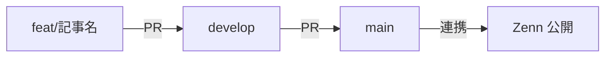

# tech_article

[Zenn](https://zenn.dev/oe_shota) に投稿する技術記事のソース管理用リポジトリです。

学習や業務で得た知見をまず **自分用のメモ** として書き溜め、内容がまとまってきたタイミングで **他者向けの記事** に整えて公開する、という二段階の運用をしています。

## Author

- **Shota Oe**
- Zenn: [@oe_shota](https://zenn.dev/oe_shota)

## ディレクトリ構成

```
.
├── articles/   # Zenn記事（Markdown）
└── README.md
```

## 記事一覧

| タイトル | 状態 | リンク |
| --- | --- | --- |
| Web版廃止でAPIサーバー専用に。Next.js → Hono移行を決断した理由 | 下書き | [articles/hono-migration-tonpedia.md](articles/hono-migration-tonpedia.md) |

## 公開フロー

Zenn の GitHub リポジトリ連携を利用して自動公開しています（Zenn CLI は使用していません）。

1. `feat/<記事名>` ブランチを切る
2. `articles/<記事名>.md` にメモ・下書きを書く
   - frontmatter の `published: false` の間は Zenn 上に表示されない
3. `develop` ブランチへ PR を出してマージ
4. `develop` → `main` へマージすると Zenn 側に反映される
5. 記事が完成したら frontmatter を `published: true` に変更し、同じフローで反映



## 記事の運用方針

- **メモ段階** (`published: false`)
  調査・試行錯誤・引用リンクなどを粒度を気にせずに書き溜める。構成や文体は気にしない。
- **公開段階** (`published: true`)
  メモが一定量たまった時点で、読者向けに構成と文章を整え直して公開する。

同一ファイルを「メモ → 公開記事」へ育てていく方針のため、`published: false` の記事は内容・粒度が整っていない場合があります。

## frontmatter 早見表

```yaml
---
title: "記事タイトル"
emoji: "🔥"          # アイキャッチ絵文字
type: "tech"         # tech | idea
topics: ["hono", "nextjs"]  # 5個まで
published: false     # true で公開
---
```
